# 银行模拟业务中心C/S

# 环境依赖

## client
* Qt 5.8
* openSSL 1.0.2o_1
* C++ 14 support
* clang++

## server
* C++ 14 support
* openSSL 1.0.2o_1
* sqlite3
* linux socket
* clang++

# 特性
* 使用C++ 14编写
* 使用JSON提高协议的可扩展性
* 使用ORM_LITE提高数据库的操作性

# 架构
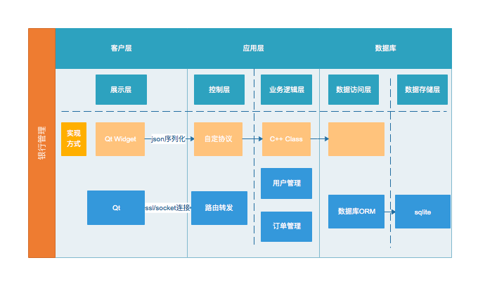

主要使用Qt绘制GUI，通过socket发送序列化的json双端进行协议交互，使用sqlite存储数据，通过数据库ORM模型进行操作。

# 流程图
## 用户流程图
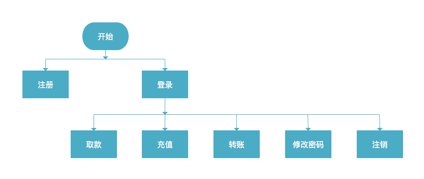

## 管理员流程图
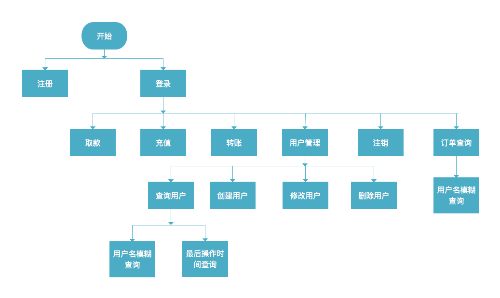

# 数据结构
## model
使用到的两个model类，并存入sqlite数据库中

### UserModel
* std::string uuid;
* std::string username;
* std::string password;
* int balance;
* int privilege;
* long lastModifyTime;

### OrderModel
* std::string uuid;
* int type;
* int amount;
* std::string out_account;
* std::string in_account;
* long record_time;

## client
* main: 程序入口
* Client: 控制客户端socket，并进行SSL连接
* Widget: 登录界面UI
* StackWidget: 控制UI界面切换
* UserLobby: 主界面UI
* DetailWidget: 订单查询界面UI
* UsersWidget: 用户管理界面UI
* DialogUser: 用户创建、修改对话框UI
* DialogPassword: 普通用户修改密码对话框UI
* DialogOrder: 转账对话框UI

## server
* main: 程序入口
* Server: 控制服务端socket，并进行SSL连接
    * int listeningSocket_; 监听客户端访问的socket
    * sockaddr_in serverAddr_; 地址信息
    * std::vector<std::thread> socketThreads_; 持有与各个客户端保持通信的线程
    * std::unordered_map<std::string, int> sockets_;  持有用户名相对应的socket链接
    * size_t count_; 连接到服务器的客户端数
    * SSL 使用
        * SSL_METHOD *meth;
        * SSL_CTX *ctx;
        * SSL *ssl;
* Dispatcher: 控制服务端路由转发后的业务逻辑
    * int connection_; 与dispatcher绑定的socket连接
    * std::string username_; 与socket连接绑定的用户名
    * Sean_Socket::Server *parent_; server指针，以访问server维护的在线列表

具体函数详见[doxygen文档](html/annotated.html)

# 结果验证
## 登录注册界面
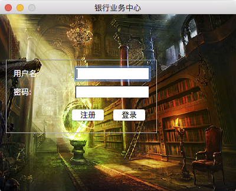

登录

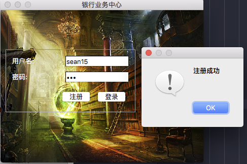

注册用户，注册用户权限为普通用户。

## 主界面
### 管理员主界面
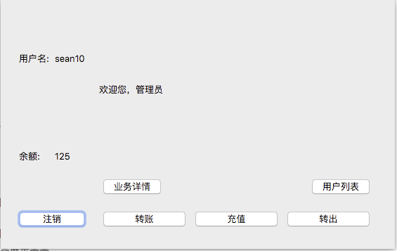

### 用户主界面
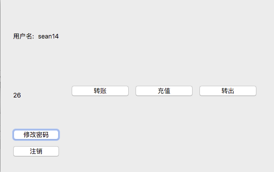

### 用户修改密码
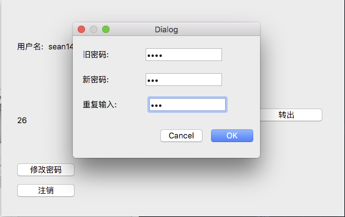

## 业务功能
### 充值
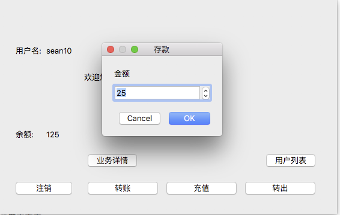

### 取款
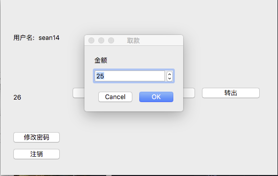

### 转账
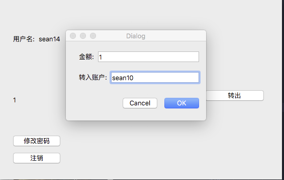

## 管理员功能

### 用户查询

#### 所有用户
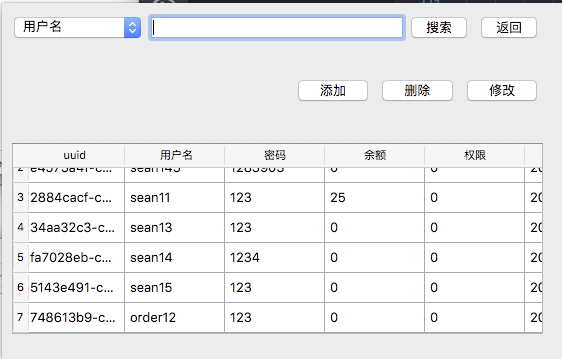

#### 模糊查询
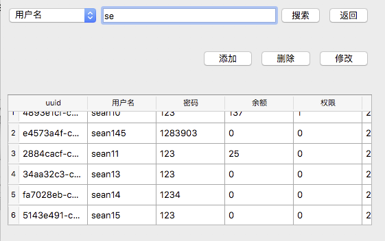

根据用户名进行模糊搜索，查询用户信息

#### 批量查询
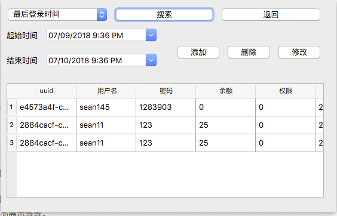

根据最后操作时间进行搜索，查询用户信息

### 管理员操作用户
#### 创建新用户/新管理员账户
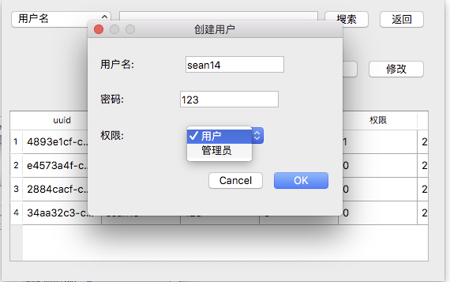

#### 修改用户名或密码
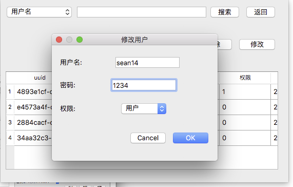

#### 删除用户
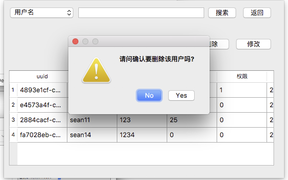

###  订单查询
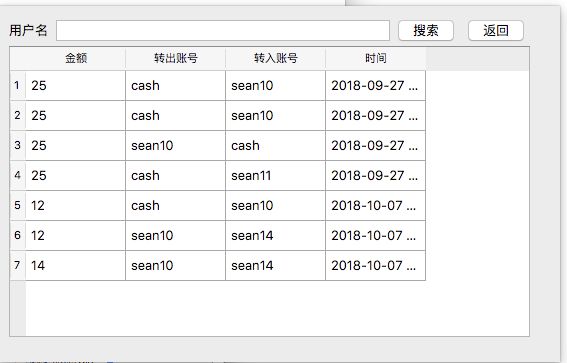

根据用户名进行模糊搜索，查询订单信息

